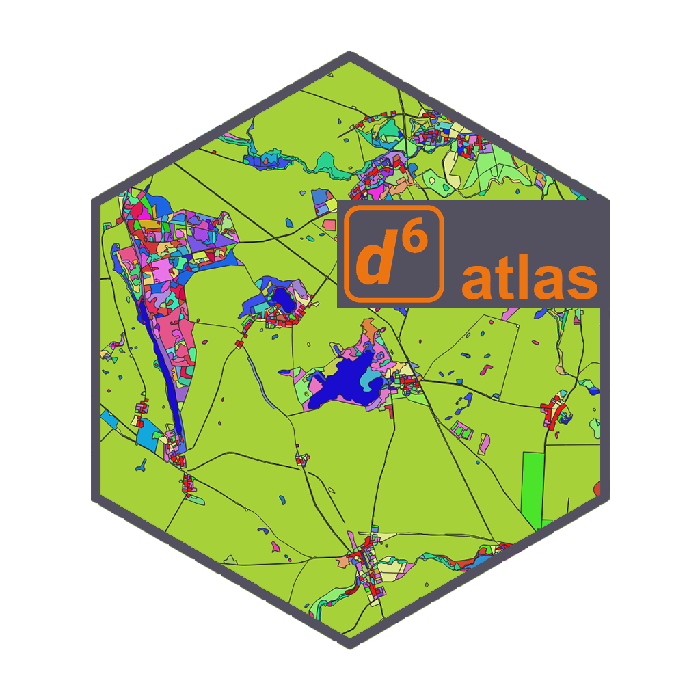

```{r, include = FALSE}
knitr::opts_chunk$set(
  collapse = TRUE,
  comment = "#>",
  fig.path = "man/figures/README-",
  out.width = "100%"
)
```

</a>

# d6atlas

<!-- badges: start -->

<!-- badges: end -->

The goal of d6atlas is to provide a fast and friendly way to plot data in the ATLAS experimental area in the Uckermark, Brandenburg. It is designed to either plot the whole area covered by the ATLAS system with options to plot your own data, or provide you with an easy tool to transform your data and plot it on a cropped map, without struggling with coordinate systems, shapefiles or other...

The maps are solely based on the current biotop maps of Brandenburg, provided by the Landesamt fuer Umwelt Brandenburg (LfU) in 2009. These were further aggregated into the main categories. For further information and a PDF about biotop classes visit <https://metaver.de/trefferanzeige?docuuid=B57B9F35-AFFF-49F2-BA32-618D1A1CD412#detail_links>

## Installation

You can install the development version of d6atlas from [GitHub](https://github.com/) with:

``` r
# install.packages("devtools")
devtools::install_github("EcoDynIZW/d6atlas")
```

(Note: If you are asked if you want to update other packages either press "No" (option 3) and continue or update the packages before running the install command again.)

Afterwards, load the functionality and data of the package in each session:


```{r}
library(d6atlas)
```


## Basic template map

The basic template map plots a map in the ATLAS experimental area in Uckermark, Brandenburg. All vector data was derived from Geoportal Brandenburg, more precisely the current biotop mapping of 2009 provided by the Landesamt fuer Umwelt Brandenburg (LfU) in 2009. These were further aggregated into the main categories. For further information and a PDF about biotop classes visit <https://metaver.de/trefferanzeige?docuuid=B57B9F35-AFFF-49F2-BA32-618D1A1CD412#detail_links>

The map is projected in **EPSG: 3035, ETRS89-extended / LAEA Europe**

```{r}
atlasplot()
```

You can customize the arguments, e.g. change the color intensity, add a scalebar, add a north arrow or remove the caption:

```{r}
atlasplot(color_intensity = 1,
          scalebar = TRUE,
          north_arrow = TRUE,
          insert_caption = TRUE)
```

## Adding locations to the map

Let’s assume you have recorded some animal locations or you want to plot another information on top of our base map. For example, let’s visualize a tracked bird by adding geom_sf(data = x) to the map object.

Here, we transform our data (starling_2547; a data set that is included in this package) to sf, assign the right coordinate system and plot the map:

```{r}
library(ggplot2)
library(sf)
starling_2547 <- d6atlas::starling_2547 %>%
  st_as_sf(coords = c("X","Y"), crs = 32633) %>%
  st_transform(crs = 3035)

map <- atlasplot(color_intensity = 0.6,
                 scalebar = FALSE,
                 insert_caption = FALSE)
map + geom_sf(data = starling_2547,
              shape = 1,
              aes(col = TIME),
              size = 1)
```


## Plot appearance

Since the output is a ggplot object, you can manipulate the result as you like

```{r message=FALSE, warning=FALSE}
library("showtext")
font_add_google("Roboto Slab","roboto slab")
showtext_auto()


map + geom_sf(data = starling_2547,shape = 18,size=2,aes(col=TIME))+
  guides(colour = guide_legend(override.aes = list(shape = 18,size=3)))+
  ggtitle("Starling captured in Dedelow")+
  labs(caption="\nVisualisation by Marius Grabow using d6atlas")+
  theme(
    legend.text = element_text(size=12),
    legend.key = element_rect(fill="white"),
    plot.title = element_text(size = 18, hjust = .5, family = "roboto slab",
                              colour ="grey20")
    )+
   ggplot2::coord_sf(xlim = c(st_bbox(starling_2547)[1]-500,st_bbox(starling_2547)[3]+500),
                     ylim = c(st_bbox(starling_2547)[2]-500,st_bbox(starling_2547)[4]+500))


#ggsave("starling.pdf", width = 12, height = 9, device = cairo_pdf)

```

## Atlasauto

atlasauto() is based on atlasplot(), but takes the functionality one step further. Here, we aim to provide users for a fast and easy way to plot your data after receiving or downloading it - without considering issues that come with spatial data (coordinate systems, etc). atlasauto uses your dataframe as an input, defines the bounding box you need to display your data without showing too much "empty" space that is out of your scope.

Let's consider you just received your data and want to have a quick look, how your animals move in the landscape:

```{r}
starling_2547<-d6atlas::starling_2547 #this data set comes with the package
# here, the crs is transformed to match the one of the underlying map, the data frame is transformed into a simple features object, the bounding box is extracted to plot a smaller window of interest.
atlasauto(d6atlas::starling_2547,
          aes_col = TIME) 
```


## Zooming into details

If you are interested in very detailed views, you can also plot subsets, e.g. by filtering your data set. Here, we are interested in what this starling did on 02.06.2022 between 06:20 & 08:40.

```{r}
library("lubridate")

atlasauto(starling_2547%>%
            dplyr::filter(starling_2547$TIME %within% interval(
              ymd_hm(202106020620),
              ymd_hm(202106020840))),
          aes_col=TIME,
          size=2)
```
